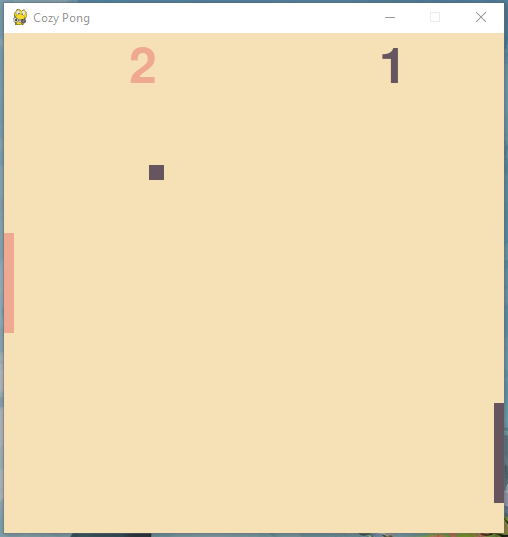

# simple pong

<h2>Description</h2>
This is a simple pong clone implemented using Python's Pygame library. It is constructed as a hybrid of an individual game and a game engine.
<h3>Game Image</h3>

  

<h3>Program Versions</h3>
- OS: Windows 10
- Python version: 3.9.2
- pygame version: 2.1.2
<h3>Motivation</h3>
The motivation behind this game choice is straightforward. I wanted to learn more about PyGame, while developing a playable deliverable. The simple game of pong fit my criteria. It is small in scope, yet contains all of the basic elements of a game, allowing me to learn and develop without being overwhelmed.
<h3>Reasoning</h3>
The structure of this game is as follows:
- pong.py - contains the primary game logic and game loop
- screen.py - contains the view logic, setup for the game screen
- paddle.py - contains class logic for the paddle entity
- ball.py - contains class logic for the ball entity
An altered version of the MVC structured is utilized, with the model and controller within one file, the view within another file, and separate files for each entity. This was chosen because of the limited external input required to play the game.
<h3>Image</h3>

  

 
<h2>Installation</h2>
To run this project use the terminal command:
 
<i>python pong.py</i>
 
<h2>Tech Stack</h2>

  
  
  

<h2>Future Work</h2>
While this game is currently complete in its default state, there are a number of additions that could be implemented to improve the complexity and player experience. 
- A title screen, pause feature, and end screen could be added to complete the game loop.
- The enemy ai could be enhanced to increase the game difficulty.
- The player could be given an option to select the difficulty level.
The game structure could also be generalized to create other games of similar style. The entity classes can be customized to fit the needs of the game developer.
 